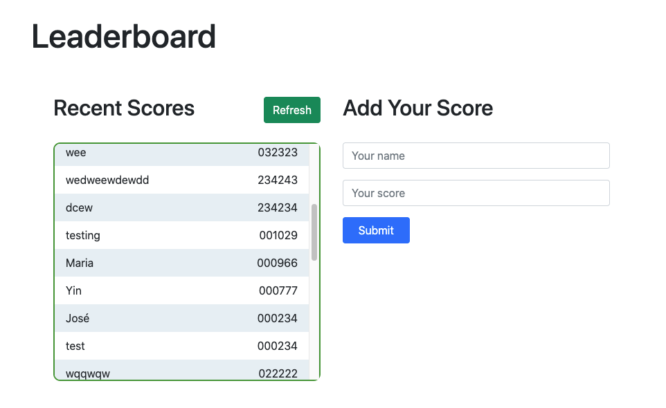

# Leaderboard

> In this activity I set up a JavaScript project for the Leaderboard list app, using webpack and ES6 features, notably modules. I consume the Leaderboard API using JavaScript async and await and add some styling.



## Built With

- HTML, CSS3, JavaScript
- Bootstrap
- Webpack

## Getting Started

**This is an example of how you may give instructions on setting up your project locally.**
**Modify this file to match your project, remove sections that don't apply. For example: delete the testing section if the currect project doesn't require testing.**


To get a local copy up and running follow these simple example steps.

### Prerequisites

    - node

### Setup

```
- npm install
- Clone the repository to your local machine.
- npm install webpack webpack-cli --save-dev
- npm install --save-dev webpack-dev-server
- npm install --save-dev style-loader css-loader
```

### Deployment

 run:
 ```
 npm run build
 ```

## Authors

👤 **Ibrohim Rasulov**

- GitHub: [@IbrohimRasulov](https://github.com/IbrohimRasulov)
- Twitter: [@IbrohimRasu1ov](https://twitter.com/IbrohimRasu1ov)
- LinkedIn: [LinkedIn](https://www.linkedin.com/in/ibrohim-rasulov-a88352209/)

## 🤝 Contributing

Contributions, issues, and feature requests are welcome!

Feel free to check the [issues page](../../issues/).

## Show your support

Give a ⭐️ if you like this project!

## Acknowledgments

- Hat tip to anyone whose code was used
- Inspiration
- etc

## 📝 License

Copyright 2021, Ibrohim Rasulov